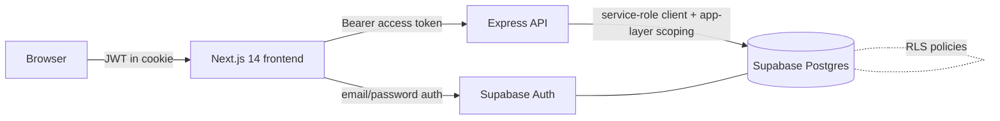

# PRMS — Property Rental Management System

A full-stack web application for managing rental properties, tenants, lease
agreements, and payments — with role-based access for **admins**, **managers**,
and **tenants**.

- **Frontend:** Next.js 14 (App Router, TypeScript), Tailwind CSS, shadcn/ui, Recharts
- **Backend:** Node 20, Express, TypeScript
- **Database / Auth:** Supabase (PostgreSQL + Row-Level Security + Supabase Auth)
- **Deploy targets:** Vercel (frontend), Render (backend), Supabase (database)

---

## Architecture



**Double enforcement of business rules.** Every rule is enforced twice — once in
the database (constraints, a partial unique index, and triggers) and once in the
application layer (services/controllers returning `409`/`403`). RLS policies add a
third safety net at the Postgres layer.

---

## Monorepo layout

```
property-rental-management/
├── backend/            # Express + TypeScript API
│   └── src/
│       ├── controllers/   # request handlers (one per resource)
│       ├── routes/        # express routers (auth, properties, tenants, agreements, payments, dashboard)
│       ├── repositories/   # Supabase data access (role-scoped in app code)
│       ├── services/      # business logic (agreement lifecycle)
│       ├── middleware/    # authenticate + requireRole
│       ├── lib/           # supabase client, asyncHandler
│       ├── __tests__/     # Jest + Supertest
│       ├── app.ts         # express app factory
│       └── server.ts      # listen()
├── frontend/           # Next.js 14 App Router
│   ├── app/               # routes: (auth), admin/*, manager/*, tenant/*, redirect, landing
│   ├── components/        # ui (shadcn), layout, views, charts, feature dialogs
│   └── lib/               # api wrapper, supabase client, hooks, types
├── docs/
│   ├── schema.sql         # tables, constraints, index, triggers, RLS policies
│   ├── seed.sql           # demo data (users, properties, tenants, agreements, payments)
│   └── api-spec.md        # full endpoint reference
└── .github/workflows/ci.yml
```

---

## Roles & permissions

| Capability | Admin | Manager | Tenant |
| --- | :---: | :---: | :---: |
| Manage all users & roles | ✓ | | |
| View/manage all properties | ✓ | own only | leased only (read) |
| Create/renew/terminate agreements | ✓ | own properties | |
| Record & mark payments paid | ✓ | own properties | view own |
| Edit own profile | ✓ | ✓ | ✓ (name/phone) |

---

## Quick start (local)

### Prerequisites
- Node.js 20+
- A Supabase project (free tier is fine)

### 1. Database (Supabase)
1. Create a project at [supabase.com](https://supabase.com).
2. In **SQL Editor**, run `docs/schema.sql`, then `docs/seed.sql`.
3. From **Project Settings → API**, copy the **Project URL**, **anon** key, and
   **service_role** key.

### 2. Backend
```bash
cd backend
cp .env.example .env      # fill in SUPABASE_URL + SUPABASE_SERVICE_ROLE_KEY
npm install
npm run dev               # http://localhost:4000  (GET /health to verify)
```

### 3. Frontend
```bash
cd frontend
cp .env.example .env.local   # fill in NEXT_PUBLIC_SUPABASE_URL/ANON_KEY + NEXT_PUBLIC_API_URL
npm install
npm run dev                  # http://localhost:3000
```

---

## Environment variables

**backend/.env**
| Name | Description |
| --- | --- |
| `SUPABASE_URL` | Supabase project URL |
| `SUPABASE_SERVICE_ROLE_KEY` | service_role key (server only — never expose) |
| `FRONTEND_URL` | allowed CORS origin (default `http://localhost:3000`) |
| `PORT` | API port (default `4000`) |
| `TEST_ADMIN_TOKEN` / `TEST_MANAGER_TOKEN` / `TEST_TENANT_TOKEN` / `TEST_TENANT_ID` | only for integration tests |

**frontend/.env.local**
| Name | Description |
| --- | --- |
| `NEXT_PUBLIC_SUPABASE_URL` | Supabase project URL |
| `NEXT_PUBLIC_SUPABASE_ANON_KEY` | anon/public key |
| `NEXT_PUBLIC_API_URL` | backend base URL (e.g. Render URL in prod) |

---

## Demo credentials

After running `docs/seed.sql`:

| Role | Email | Password |
| --- | --- | --- |
| Admin | `admin@prms.dev` | `Admin1234!` |
| Manager | `manager@prms.dev` | `Manager1!` |
| Tenant | `tenant1@prms.dev` | `Tenant1!` |
| Tenant | `tenant2@prms.dev` | `Tenant1!` |

---

## Business rules

1. **One active agreement per property** — enforced by a partial unique index
   (`one_active_agreement_per_property`) and an app-layer `409`.
2. **Agreements only on vacant properties** — `409` otherwise.
3. **Property status auto-syncs** — a trigger sets a property to `occupied` when an
   agreement becomes active and `vacant` when it is terminated/expired.
4. **Renewal** — expires the current lease and creates a new active one with a
   later end date.
5. **Tenants with an active agreement cannot be deleted** — `409`.
6. **Role scoping** — managers see only their own properties; tenants see only
   their own lease and payments.

---

## Testing

```bash
cd backend && npm test
```
- **Unit + smoke tests** always run (no database needed).
- **Business-rule integration tests** run only when `SUPABASE_URL`,
  `SUPABASE_SERVICE_ROLE_KEY`, and the `TEST_*` tokens are set; otherwise they are
  skipped. Obtain tokens by logging in via `POST /api/auth/login` (or the Supabase
  client) and setting them in `backend/.env`.

---

## CI

`.github/workflows/ci.yml` runs on every push/PR to `main`/`develop`:
- **Backend:** `npm ci → npm run build → npm test`
- **Frontend:** `npm ci → npm run lint → npm run build`

Integration tests use repository **Secrets** (`SUPABASE_URL`,
`SUPABASE_SERVICE_ROLE_KEY`, `TEST_ADMIN_TOKEN`, `TEST_MANAGER_TOKEN`,
`TEST_TENANT_TOKEN`, `TEST_TENANT_ID`) when present.

---

## Deployment

Deploy in this order:

1. **Supabase** — run `docs/schema.sql` + `docs/seed.sql` (database is live immediately).
2. **Render (backend)** — New Web Service → root directory `backend`, build
   `npm install && npm run build`, start `npm start`, Node 20. Add the backend env
   vars. Copy the resulting service URL.
3. **Vercel (frontend)** — root directory `frontend`. Set `NEXT_PUBLIC_SUPABASE_URL`,
   `NEXT_PUBLIC_SUPABASE_ANON_KEY`, and `NEXT_PUBLIC_API_URL` (= the Render URL).

> **Cold-start note:** Render's free tier sleeps after inactivity. Ping the
> backend `GET /health` ~2 minutes before a demo so the first real request is fast.

---

## Notes / implementation decisions

- The seed inserts real Supabase **auth** users (not just `public.users`) so the
  demo credentials log in out of the box; the `handle_new_user` trigger mirrors
  them into `public.users`.
- Role areas use real URL segments (`/admin/*`, `/manager/*`, `/tenant/*`) so the
  three dashboards don't collide on a single `/dashboard` path.
- Form dropdowns use styled native `<select>` elements; all other UI uses shadcn/ui.

See [`docs/api-spec.md`](docs/api-spec.md) for the full API reference.
